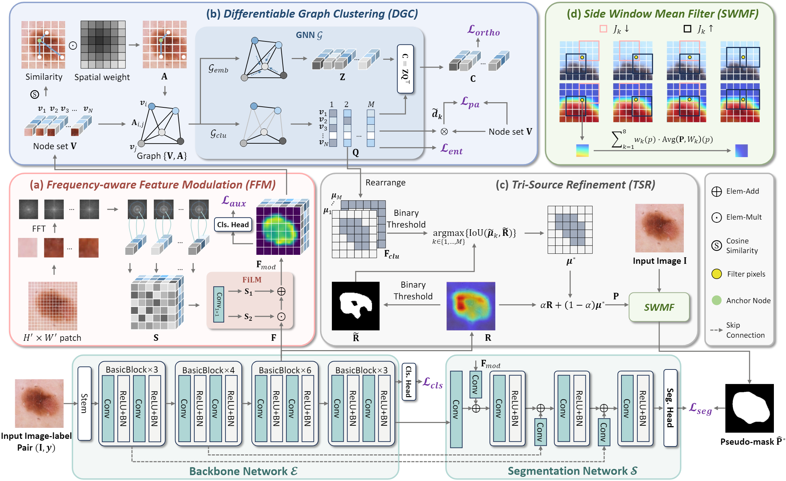

# Frequency and Geometry Guided Graph Clustering for Weakly Supervised Skin Lesion Segmentation-MICCAI2026
## Abstract
Pixel-level annotation for skin lesion segmentation is costly and subjective. This limits large-scale clinical deployment. Weakly supervised methods based on image-level labels alleviate this burden. However, most existing methods rely on class activation maps (CAMs), which often fail to cover the entire lesion. 
To address this, we introduce a Frequency and Geometry Guided Graph Clustering framework, reformulating weakly supervised skin lesion segmentation as a differentiable node-clustering problem. 
First, a Frequency-aware Feature Modulation module injects local spectral priors into deep features. This enhances the model's sensitivity to ambiguous boundaries. Second, we construct a semantic-spatial graph from these features. A graph neural network (GNN) then captures long-range dependencies to ensure structural completeness. 
Finally, we propose a tri-source fusion strategy that integrates three cues (GNN cluster, CAM, and the input image) via an improved side-window mean filtering. Experiments on ISIC 2017, ISIC 2018, and PH<sup>2</sup> show that our method achieves state-of-the-art performance. 
It significantly narrows the gap with fully supervised models, providing a reliable solution for label-efficient skin lesion analysis.
## Framework

## Usage

### Dataset

```
FG3-Cluster/
├── datasets
│   ├── PH2/
│   │   ├── Data_enhancement_train.csv
│   │   ├── PH2_test_transformed.csv
│   │   ├── Data_enhancement_train/
│   │   └── Data_enhancement_mask_train/
│   ├── ISIC2017/
│   │   ├── train_set.csv
│   │   ├── test_set.csv
│   │   ├── ISIC-2017_Training_Data/
│   │   └── ISIC-2017_Training_Part1_GroundTruth/
│   └── ISIC2018/
│       ├── isic_schemeA_train_7_3.csv
│       ├── isic_schemeA_test_7_3.csv
│       ├── ISIC2018_image/
│       └── ISIC2018_GT/
├── main.py
├── SWMF.py
├── requirements.txt
└── README.md
```

### Pretrained weights, datasets, and checkpoints

The ImageNet-pretrained ResNet34 weights will be downloaded automatically through `torchvision`.

Please download the datasets from the official dataset pages or the prepared dataset links:

* PH2 dataset: [official PH2 dataset page](https://www.fc.up.pt/addi/ph2%20database.html)
* ISIC 2017 dataset: [official ISIC 2017 challenge page](https://challenge.isic-archive.com/data/#2017)
* ISIC 2018 dataset: [official ISIC 2018 challenge page](https://challenge.isic-archive.com/data/#2018)

For ISIC 2018 metadata, click the **Actions** icon in the upper-right corner of the following ISIC Archive collection pages to download the metadata files:

* [ISIC 2018 Task 1-2 Training Metadata](https://api.isic-archive.com/collections/63/)
* [ISIC 2018 Task 1-2 Validation Metadata](https://api.isic-archive.com/collections/62/)
* [ISIC 2018 Task 1-2 Test Metadata](https://api.isic-archive.com/collections/64/)

### Run each step:

1、Train the classification model, generate pseudo masks, and train the segmentation branch with image-level labels:

```python
python main.py --dataset_name PH2 --batch_size 64 --epoch 100
```

```python
python main.py --dataset_name ISIC2017 --batch_size 256 --epoch 200
```

```python
python main.py --dataset_name ISIC2018 --batch_size 256 --epoch 200
```

2、Evaluate a checkpoint once:

```python
python main.py --dataset_name PH2 --batch_size 64 --eval_ckpt --eval_only
```

```python
python main.py --dataset_name ISIC2017 --batch_size 256 --eval_ckpt --eval_only
```

```python
python main.py --dataset_name ISIC2018 --batch_size 256 --eval_ckpt --eval_only
```
